# C4 Architecture Model

## Context Diagram

## Ingest Platform Container Diagram

### Key Quality attributes

- Debuggability and Testability—The ETL Pipelines are intended to be simple, FIFO-style processors. If an issue arises,
  developers should be able to look at the queue, replay a message, and see the output captured in the Data Market. They
  should be able to compare expected vs. actual results to identify and zero in on issues.
- Extensibility and Portability—The processors should use a pipe-and-filter approach. Essential functions should be
  reusable and extensible by adding additional sinks. Different hospitals may require specific processing to anonymize a
  document.
- Scalability—The queue and Processors should scale horizontally. The integration engine license requires us to pay
  based on the number of deployed instances, so scaling horizontally may cost less than scaling vertically.
- Security—The system is secure at multiple locations. The integration engine has built-in security, LDAP integration,
  and other features. Data queues will use token-based authentication for reads/writes. The ETL pipelines will read from
  the service queues but cannot be contacted via an API. The vector of attack with the most significant impact in this
  system is the queue.

## Anonymous Master Person Index Diagram

### Key Quality attributes

- Debuggability and Testability—This system allows easy test automation using something like Newman to test the input/
  output end-to-end. We essentially issue a command to the Command API and test the result in the Query API.
- Extensibility— CQRS offers excellent flexibility, which can contribute to extensibility. We have a clear separation of
  concerns for reads and writes, so we are free to optimize and evolve models for readability writability and have
  flexible choices for data storage options depending on how our models/ needs evolve.
- Scalability—All components in this system are horizontally scalable. If we have high volumes of writes, we can
  increase the Command API and Cache instances. If we need higher throughput, we can increase command executor
  instances. If we are overwhelmed by query instances, we can improve the query REST service instances and add
  replications for the AMPI store.
- Security—The system is secure at multiple locations. Both REST endpoints can be secured via Token-based authorization.
  They are not directly exposed to the outside and are intended to be used in an internal service-to-service fashion.
  The command executor cannot be communicated directly; it scans the command cache regularly to perform data operations.

## Data Market Container Diagram

### Key Quality attributes

- Debuggability and Testability—The entry point for all operations is throughout input systems, the router, and Search
  REST APIs. Elk lets us capture the payload and logs as we receive them and whether subsequent operations succeeded or
  failed. If we couple that with alerting built into Slack for Chat Ops and dashboards via Kibana, it's easy to detect
  issues and narrow them down to specific components.
- Extensibility and Portability—The pipeline is designed so it is possible to add additional external sinks or add
  stores within our data market. The router uses a rules-based approach that lets us add multiple locations.
- Scalability—The router and Search REST API are intended to be horizontally scalable. In contrast, the various data
  stores in the market are designed to be active-active setups with replications in multiple data centers.
- Security—The system is secure at multiple locations. The API gateway validates access from Tesselate.io. The Tokens
  issued to clients using Tesselate.IO are encrypted, and the API Gateway can decrypt them and validate their signatures
  and claims. Internal service-to-service communication is secured by a separate token issuer, which uses unencrypted
  tokens.

## Tessellate.IO Container Diagram

